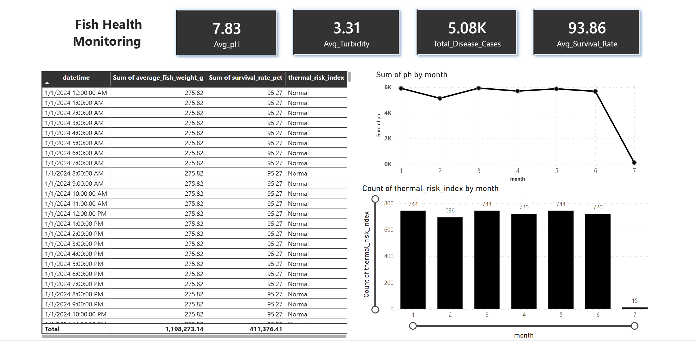

# Tilapia IoT Aquaculture Monitoring & Analytics in Microsoft Fabric

## Project Overview
This project implements an end-to-end IoT analytics solution in Microsoft Fabric for monitoring water quality, 
fish health, and risk indicators in tilapia aquaculture environments.

The solution is built using:
- Medallion Architecture (Bronze → Silver → Gold)
- Microsoft Fabric Lakehouse (Delta tables)
- PySpark transformations in Fabric Notebooks
- Star Schema modeling for analytical queries
- Power BI dashboard for real-time aquaculture insights

The pipeline transforms raw IoT telemetry into meaningful insights on water quality, fish survival rate, disease 
occurrence, and operational risks.

### About the Dataset

### IoT Monitoring Dataset of Water Quality & Tilapia Health (Montería, Colombia – 2024)

This dataset contains six months of continuous IoT sensor monitoring data from tilapia (Oreochromis niloticus) 
Aquaculture ponds in Montería, Colombia. Using an advanced IoT-based water quality monitoring system, hourly 
readings were collected to track environmental parameters and fish health indicators.

The dataset enables real-time analytics on:
- Water quality fluctuations (DO, pH, temperature, turbidity)
- Fish health patterns (survival rate, disease occurrence)
- Environmental risk levels (thermal risk, oxygen alerts)
- Operational interventions (oxygenation, corrective measures)

- **Collection Period:** January – June 2024
- **Frequency:** Hourly sensor readings
- **Domain:** Aquaculture / Environmental IoT / Fish Farming

This dataset supports modelling and analysis of how water conditions influence fish health and risk levels in 
aquaculture environments.

### Data Dictionary
| Column Name                    | Description                                             |
| ------------------------------ | ------------------------------------------------------- |
| **Datetime**                   | Timestamp of each IoT reading                           |
| **Month**                      | Month of data collection (Jan–Jun)                      |
| **Average Fish Weight (g)**    | Avg tilapia weight in grams                             |
| **Survival Rate (%)**          | % of fish surviving during the period                   |
| **Disease Occurrence (Cases)** | Count of disease cases                                  |
| **Temperature (°C)**           | Water temperature measurement                           |
| **Dissolved Oxygen (mg/L)**    | Dissolved oxygen concentration                          |
| **pH**                         | Acidity/alkalinity measurement                          |
| **Turbidity (NTU)**            | Water turbidity (clarity)                               |
| **Oxygenation Automatic**      | Whether automatic oxygenation was triggered (Yes/No)    |
| **Oxygenation Interventions**  | Manual oxygenation actions (Yes/No)                     |
| **Corrective Interventions**   | Number of corrective measures taken                     |
| **Thermal Risk Index**         | “High” or “Normal” based on temperature risk            |
| **Low Oxygen Alert**           | “Critical” if DO < 5 mg/L; otherwise “Safe”             |
| **Health Status**              | “At Risk” or “Stable,” based on thermal and oxygen risk |

## Architecture & Implementation

## ⚙️ Data Processing Steps

The project follows a **Medallion Architecture** for **data lakehouse processing**:

### 1. Load Data into Microsoft Fabric Lakehouse
- Raw CSV files uploaded into the **Lakehouse**.
- **Bronze layer** stores raw, unprocessed data.

### 2. Bronze Layer
- Sanitize column names (remove spaces/special characters).
- Load raw data without transformations.

### 3. Silver Layer (Transformations)
- Handle **null values**: replace with `"Unknown"` for strings, `0` for numeric columns.
- Remove **duplicate rows**.
- Convert **date column** to proper DateType.
- Ensure correct **data types** for numeric and text columns.

### 4. Gold Layer (Star Schema Modeling)
- **Dimension Tables:**
  - **gold_dim_date:** date_id, date_key, Year, Month, day
  - **gold_dim_time:** timeid, hour
  - **gold_dim_health_status:** health_status_id, health_status
  - **dim_risk_index:** risk_index_id, thermal_risk_index
  - **dim_oxygen_alert:** oxygen_alert_id, low_oxygen_alert
  - **dim_corrective_measures:** corrective_id, corrective_measures
  - **dim_source_file:** source_id, source_file
- **Fact Table:**
  - **gold_fact_environment:** date_id, time_id, health_status_id, risk_index_id, oxygen_alert_id, corrective_id, source_id, datetime, average_fish_weight_g, survival_rate_pct, disease_occurrence_cases, temperature_c, dissolved_oxygen_mg_l, ph, turbidity_ntu, oxigeno_scaled, ph_scaled, turbidez_scaled, oxygenation_interventions, corrective_interventions, oxygenation_automatic, thermal_risk_index, low_oxygen_alert, health_status, ingestion_timestamp
- **Surrogate Keys** are generated for dimensions to optimize joins.
- **Joins** link fact table with dimensions for analytics queries.

---

## 📊 Power BI Dashboard

**Dashboard Name:** Power BI Dashboard – Fish Health Monitoring

